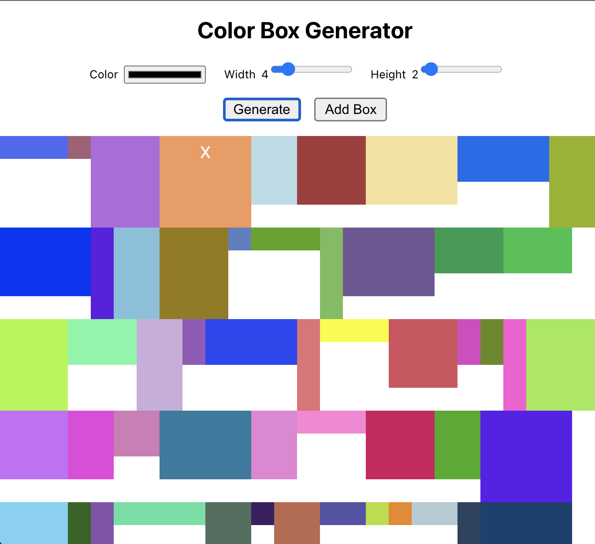
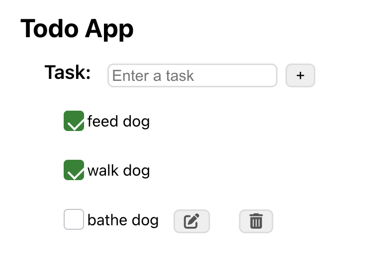

# React Forms Exercises

These exercises will give you more practice working with React forms.

## Testing Requirements

Make sure both of these apps have tests. Here are the guidelines for testing:

- **Every component needs a smoke + snapshot test.**
- **Critical Business Logic needs tests too.** Use your judgement for this, but make sure you cover core functionality. Examples include: the ability to enter data, submit a form, and have the desired outcome appear in the DOM.

## Part 1 - Color Box Maker

Create a new React application, which contains the following components:

- _**App**_ - this component should render the BoxList component.
  BoxList - Place your state that contains all of the boxes here. This component should render all of the _**Box**_ components along with the NewBoxForm component
- _**Box**_ - this component should display a div with a background color, width and height based on the props passed to it.
- _**NewBoxForm**_ - this component should render a form that when submitted, creates a new _**Box**_. You should be able to specify the _**Box**_’s width, height, and background color. When the form is submitted, clear the input values.
- When each _**Box**_ component is displayed, add a button with the text of of “X” next to each _**Box**_. When this button is clicked, remove that specific box. This will require you to pass a function down as props - the button should not be a separate component, it should be included in the _**Box**_ component.

## Part 2 - Todo App - List, Add, Remove Todos

Create a Todo App that allows users to see, add, edit, and remove todos. It should contain the following components.

- _**App**_ - this component should render the _**TodoList**_ component
- _**TodoList**_ - this component should render the _**NewTodoForm**_ component and should render the list of Todo components. Place your state that contains all of the todos in this component.
- _**NewTodoForm**_ - this component should render a form with one text input for the task to be created. When this form is submitted, a new Todo component should be created. - _**Todo**_- this component should display a _**div**_ with the task of the todo.
- For each Todo component, there should also be a button with the text “X” that when clicked, removes the todo.

## Further Study

- It’s time to edit some todos! Each _**Todo**_ component should also display a button with the text “edit” that when clicked, displays _**form**_ with the task of the todo as an input and a button to submit the form. When the form is submitted, the task of the text should be updated and the form should be hidden.
- When each _**Todo**_ component is displayed, add a button with the text of “Mark as completed”. When this button is clicked, add a strike through the text of the todo.
- Instead of a button that when clicked adds a strike through, refactor your application so that when that button is clicked, if the todo is completed (something each todo will have in state), add a strike through, otherwise if a todo is not completed, remove the strike through.
- Add some styling to your application! Try to use a CSS animation that fades out a Todo when it is deleted (this will involve adding/removing CSS classes). Write this using SASS!
- Save your todos in localStorage and retrieve them when the page loads.

## **How to Run**

    $ git clone https://github.com/cng008/39.8_react-forms.git
    $ cd color-box-maker <!--to run color-box-maker-->
    $ cd todo-app <!--to run todo-app-->
    $ npm install
    $ npm start

Tests are run using Jest.
To run the tests in order:

    npm run test
